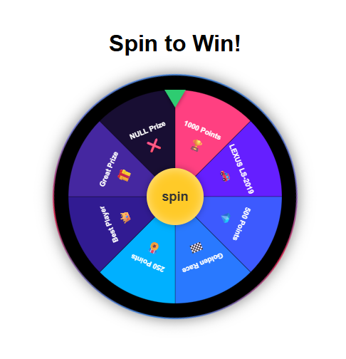

# React Gift Spinner

A customizable and interactive prize wheel/spinner component for React applications. Designed for giveaways, games, promotions, and interactive user experiences.



## Features

- Interactive spinning wheel with smooth animations
- Fully customizable colors, labels, and icons
- Probability-based prize selection
- **Flexible prize count** - supports any number of prizes
- Responsive design for mobile and desktop
- Support for custom prize data
- TypeScript support with full type definitions
- Callback functionality when prize is selected
- Unique prefixed class names to avoid conflicts
- CSS automatically included (no separate import needed)

## Installation

```bash
npm install react-gift-spinner
# or
yarn add react-gift-spinner
```

## Quick Start

```jsx
import React, { useState } from 'react';
import { GiftSpinner } from 'react-gift-spinner';
// CSS is automatically imported

function App() {
  const [prize, setPrize] = useState(null);
  
  const handlePrizeSelected = (selectedPrize) => {
    setPrize(selectedPrize);
    console.log('Selected prize:', selectedPrize);
  };

  return (
    <div className="app">
      <h1>Spin to Win!</h1>
      
      <GiftSpinner onPrizeSelected={handlePrizeSelected} />
      
      {prize && (
        <div className="winning-message">
          <p>Congratulations! You won: {prize.icon} {prize.label}</p>
        </div>
      )}
    </div>
  );
}

export default App;
```

## Custom Prizes

You can provide your own custom prizes with different probabilities:

```jsx
import React from 'react';
import { GiftSpinner } from 'react-gift-spinner';

// The 'probability' value is the exact percentage chance for each prize.
// For example, probability: 10 means 10% chance, probability: 0.5 means 0.5% chance.
const customPrizes = [
  { 
    label: "1000 Points", 
    color: "#ff4081",
    icon: "🏆",
    probability: 10  // 10% chance
  },
  { 
    label: "LEXUS LS-2019", 
    color: "#651fff",
    icon: "🚗",
    probability: 0.5  // 0.5% chance (rare)
  },
  { 
    label: "500 Points", 
    color: "#3d5afe",
    icon: "💎",
    probability: 15  // 15% chance
  },
  { 
    label: "Golden Race", 
    color: "#2979ff",
    icon: "🏁",
    probability: 10  // 10% chance
  },
  { 
    label: "250 Points", 
    color: "#00b0ff",
    icon: "🎖️",
    probability: 30  // 30% chance (common)
  },
  { 
    label: "Best Player", 
    color: "#311b92",
    icon: "👑",
    probability: 4  // 4% chance
  },
  { 
    label: "Great Prize", 
    color: "#4527a0",
    icon: "🎁",
    probability: 15  // 15% chance
  },
  { 
    label: "NULL Prize", 
    color: "#512da8",
    icon: "❌",
    probability: 0  // 0% chance - will never be selected
  }
];

function App() {
  return <GiftSpinner customPrizes={customPrizes} />;
}
```

## Flexible Prize Count

The spinner automatically adapts to any number of prizes. You can provide as few as 2 or as many as needed:

```jsx
// Example with 6 prizes
const sixPrizes = [
  { label: "Prize 1", color: "#ff4081", icon: "🏆", probability: 20 },
  { label: "Prize 2", color: "#651fff", icon: "🚗", probability: 15 },
  { label: "Prize 3", color: "#3d5afe", icon: "💎", probability: 25 },
  { label: "Prize 4", color: "#2979ff", icon: "🏁", probability: 10 },
  { label: "Prize 5", color: "#00b0ff", icon: "🎖️", probability: 20 },
  { label: "Prize 6", color: "#311b92", icon: "👑", probability: 10 }
];

// Example with many prizes
const manyPrizes = [
  // ... 10 or more prizes ...
];

// The spinner will automatically adjust segment sizes, text positioning, 
// and font sizes to accommodate the number of prizes
```

## API Reference

### Props

| Prop | Type | Default | Description |
|------|------|---------|-------------|
| `customPrizes` | `PrizeItem[]` | `defaultPrizes` | Array of prize objects |
| `onPrizeSelected` | `(prize: PrizeItem) => void` | `undefined` | Callback function when a prize is selected |
| `className` | `string` | `''` | Additional CSS class for styling |

### PrizeItem Interface

```typescript
interface PrizeItem {
  label: string;        // Text to display on the wheel
  color: string;        // Background color (hex, rgb, etc.)
  icon: string | React.ReactNode; // Emoji, URL to image, or React component
  probability: number;  // Percentage chance for this prize (e.g. 10 means 10%, 0.5 means 0.5%)
}
```

## CSS Classes

All CSS classes in this component are prefixed with `rgp-` to avoid conflicts with your existing styles. Key classes include:

- `rgp-gift-spinner-container` - Main container
- `rgp-wheel-container` - Wheel wrapper 
- `rgp-wheel` - The spinning wheel itself
- `rgp-segment` - Individual wheel segments
- `rgp-center-button` - Center spin button
- `rgp-indicator` - Arrow indicator 

## Browser Support

- Chrome (latest)
- Firefox (latest)
- Safari (latest)
- Edge (latest)
- Mobile browsers (iOS Safari, Chrome for Android)

## Development

To run the project locally:

1. Clone this repo
2. Install dependencies: `npm install`
3. Start the development server: `npm start`

## Building

```bash
npm run build
```

## License

MIT © Alireza Azizi

## Live Demo

Try it out instantly on CodeSandbox: [Live Demo](https://codesandbox.io/p/sandbox/fdcz4c)
